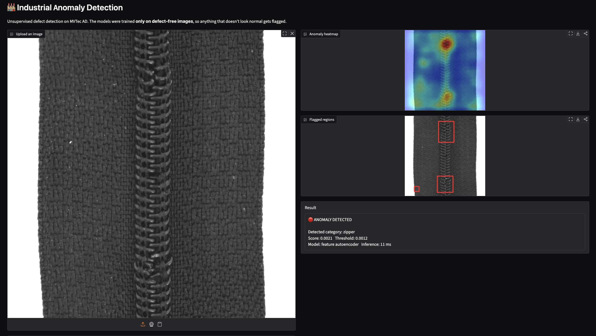

# Unsupervised Anomaly Detection for Industrial Inspection

Detecting and localizing manufacturing defects **without a single labeled defect** — models are trained only on images of good parts and flag anything that doesn't look normal.

**[Live demo on Hugging Face Spaces](https://huggingface.co/spaces/AradhyaSomani/industrial-anomaly-detection)**



---

## Why this problem is hard

Real production lines produce very few defects, and the defects they do produce are varied and unpredictable. Collecting and pixel-labeling enough examples to train a supervised classifier is expensive, and a supervised model only recognizes the defect types it was shown.

This project takes the unsupervised route used in industrial visual inspection: **learn what "normal" looks like, and treat deviation from it as an anomaly.** No anomaly labels are used for training *or* for choosing the decision threshold — test labels and masks are used only to report metrics.

## Dataset

[MVTec AD](https://www.mvtec.com/company/research/datasets/mvtec-ad) — ~5,350 high-resolution images across 15 categories (5 textures, 10 objects). Each category has 60–400 defect-free training images and a test set of good and defective images with pixel-level ground-truth masks. One model is trained per category.

## Approach

### 1. Pixel-reconstruction autoencoder (baseline)
A convolutional autoencoder (256×256 input, 16×16 bottleneck) trained to reconstruct normal images. Defective regions can't be reconstructed well, so reconstruction error highlights them.

- **Loss:** 0.5 · MSE + 0.5 · (1 − SSIM). Pure MSE produces blurry reconstructions whose edge errors cause false positives; SSIM focuses on structure, where most defects appear.
- **Decoder:** bilinear upsampling + convolution instead of transposed convolutions, which removed checkerboard artifacts that showed up as false anomalies.
- **Anomaly map:** per-pixel L2 error and SSIM error, each z-normalized using statistics from held-out normal images, combined and Gaussian-smoothed (σ = 4).

### 2. Feature-reconstruction autoencoder (main model)
Instead of reconstructing pixels, the autoencoder reconstructs **features from a frozen ImageNet-pretrained WideResNet-50** (layers 2 + 3, 1536 channels at 32×32, with 3×3 local averaging for neighborhood context). A small 1×1-convolution autoencoder (latent size 200) learns to reconstruct normal feature vectors. The anomaly map is the per-location feature reconstruction error, upsampled and smoothed. This follows the idea of deep feature reconstruction (DFR).

Pretrained features already encode texture, color and part identity, so defects that are invisible in pixel error — fine texture damage, swapped or missing components — become obvious.

### Data augmentation
With only 60–400 training images per category, augmentation matters — but it must never create something that *looks like a defect*, or the model learns to treat real defects as normal.

| Category type | Augmentations | Avoided |
|---|---|---|
| Textures (carpet, grid, leather, tile, wood) | H/V flips, 90° rotations | noise, blur |
| Rotation-invariant objects (bottle, hazelnut, metal_nut, screw) | flips, 90° rotations | strong color jitter |
| Orientation-sensitive objects (cable, capsule, pill, toothbrush, transistor, zipper) | very mild brightness/contrast only | flips and rotations (a flipped transistor *is* a defect) |

### Scoring and threshold (fully unsupervised)
- **Image score:** mean of the top 1% of anomaly-map values — robust to single noisy pixels without diluting small defects the way a global mean does.
- **Threshold:** 15% of the training images are held out as a normal-only validation set. The threshold is the 95th percentile of their scores. No defective image is ever used to tune it.

## Results

Image-level AUROC measures separating good from defective parts; pixel-level AUROC measures defect localization.

| Category | Pixel AE (img) | **Feature AE (img)** | Pixel AE (pix) | **Feature AE (pix)** |
|---|---|---|---|---|
| bottle | 0.969 | **1.000** | 0.766 | **0.985** |
| cable | 0.319 | **0.918** | 0.507 | **0.969** |
| capsule | 0.674 | **0.903** | 0.844 | **0.989** |
| carpet | 0.488 | **0.973** | 0.910 | **0.988** |
| grid | 0.872 | **0.926** | **0.977** | 0.961 |
| hazelnut | 0.919 | **0.997** | 0.932 | **0.983** |
| leather | 0.764 | **1.000** | 0.963 | **0.992** |
| metal_nut | 0.792 | **0.994** | 0.580 | **0.974** |
| pill | 0.840 | **0.908** | 0.894 | **0.982** |
| screw | **0.474** | 0.364 | 0.912 | **0.968** |
| tile | 0.647 | **0.996** | 0.875 | **0.955** |
| toothbrush | **0.986** | 0.944 | 0.978 | **0.989** |
| transistor | 0.645 | **0.942** | 0.670 | **0.903** |
| wood | 0.930 | **0.986** | 0.842 | **0.942** |
| zipper | 0.924 | **0.976** | 0.958 | **0.985** |
| **Mean** | 0.749 | **0.922** | 0.841 | **0.971** |

Feature reconstruction raises mean image AUROC from **0.749 → 0.922** and mean pixel AUROC from **0.841 → 0.971**. The demo automatically uses whichever model scored higher for each category.

### Ablation: anomaly scoring (pixel AE, bottle)

| Scoring | Image AUROC | Pixel AUROC |
|---|---|---|
| L2 error only | 0.883 | 0.785 |
| SSIM error only | **0.951** | **0.909** |
| L2 + SSIM (combined) | 0.933 | 0.905 |

Bottle defects (cracks, broken rims, contamination) are structural changes that squared pixel error largely misses. SSIM gives the best separation; the combined score gave the best F1 at the automatic threshold.

### Qualitative results


*Input, anomaly map and ground-truth mask for each carpet defect type (feature autoencoder).*

## What didn't work, and why

- **Pixel AE on textures (carpet 0.488, screw 0.474).** The autoencoder can't reproduce fine, high-frequency detail such as carpet fibers or screw threads, so *every* image has high error and good and bad parts become indistinguishable. Interestingly, pixel AUROC stayed around 0.91 — the heatmaps found the defects, but scattered errors on normal images swamped the image-level score.
- **Pixel AE on cable (0.319 — worse than random).** Several cable defects are *logical*: a missing wire or swapped wire colors. A missing wire makes the image *simpler* and easier to reconstruct, so it scores as *more* normal. Reconstruction error can't detect "the parts are in the wrong arrangement." Pretrained features fix this (0.918) because they encode color and part identity.
- **Screw remains unsolved (0.364 with features).** Screws appear at arbitrary angles and positions, while training only covered 90° rotations, so an ordinary screw at an unusual angle scores as anomalous as a real defect. Localization is still good (pixel AUROC 0.968). Full-range rotation augmentation or a rotation-invariant representation is the obvious next step.
- **AUROC vs. threshold.** Zipper's pixel AE reached 0.92 image AUROC but only 0.29 recall at a 99th-percentile threshold calibrated on ~36 normal images. The model separated the classes fine — the threshold was too strict. Moving to the 95th percentile raised recall to 0.94. AUROC measures the model; precision/recall measure the threshold.

## Demo features

- Upload any image and get an anomaly heatmap, bounding boxes around the most anomalous regions, and a verdict with score and threshold.
- **Automatic category detection:** the image is scored against every category's model and assigned to the one where it looks most normal — the same "what looks normal" idea used to detect defects.
- **Threshold slider** to explore the precision/recall trade-off live.
- Switch between pixel and feature models; inference time is shown (~30 ms per image on an Apple-silicon GPU).

## Project structure

```
src/
  dataset.py         MVTec loader with category-aware augmentation
  model.py           Convolutional (pixel) autoencoder
  scoring.py         Error maps, normalization, image score
  train.py           Train pixel AE
  evaluate.py        Evaluate pixel AE (L2 / SSIM / combined), calibrate threshold
  feature_model.py   WideResNet-50 feature extractor + feature autoencoder
  train_feat.py      Train feature AE
  evaluate_feat.py   Evaluate feature AE, calibrate threshold
app.py               Gradio demo
```

## Running it yourself

```bash
python3 -m venv venv && source venv/bin/activate
pip install -r requirements.txt

# Download MVTec AD into data/ (category folders directly inside data/)

# Pixel autoencoder
python src/train.py --category bottle --epochs 200
python src/evaluate.py --category bottle --pct 95

# Feature autoencoder
python src/train_feat.py --category bottle
python src/evaluate_feat.py --category bottle

# Demo
python app.py
```

Uses CUDA or Apple-silicon (MPS) GPUs automatically, falling back to CPU. Training all 15 categories takes a few hours on a laptop GPU.

## Limitations and future work

- One model per category; a single multi-class model would be more practical to deploy.
- Thresholds are calibrated on small normal-only validation sets (~10–60 images), so they are noisy. Real deployments would calibrate on more data and pick the operating point from the cost of a missed defect versus a false alarm.
- Results come from a single training run per category; reporting mean ± std over several seeds would make comparisons more reliable.
- Next steps: full-rotation augmentation for screw, the PRO localization metric, a comparison against memory-bank methods such as PatchCore, and ONNX export for faster CPU inference.

## References

- Bergmann et al., *MVTec AD — A Comprehensive Real-World Dataset for Unsupervised Anomaly Detection*, CVPR 2019.
- Bergmann et al., *Improving Unsupervised Defect Segmentation by Applying Structural Similarity to Autoencoders*, 2018.
- Shi et al., *Unsupervised Anomaly Segmentation via Deep Feature Reconstruction*, Neurocomputing 2021.

The MVTec AD dataset is licensed under CC BY-NC-SA 4.0 and is not included in this repository.
