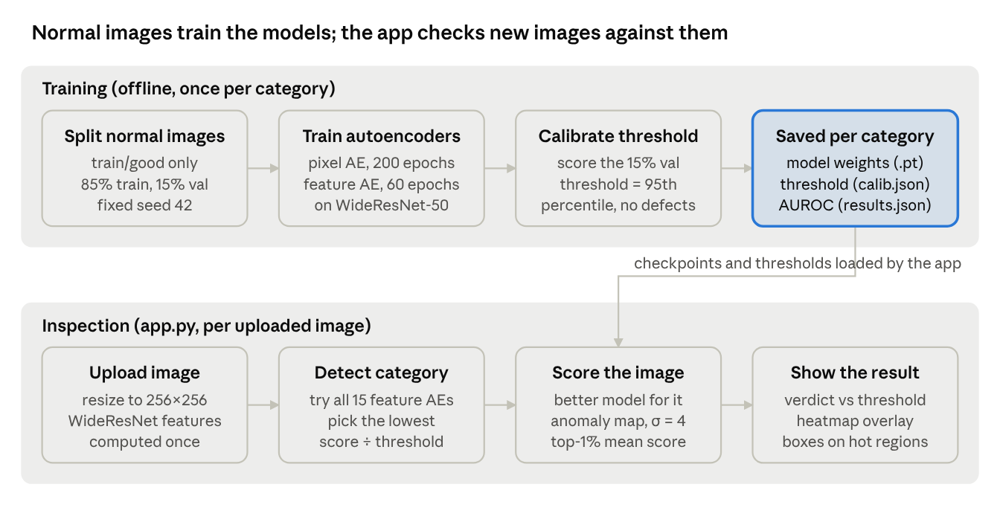
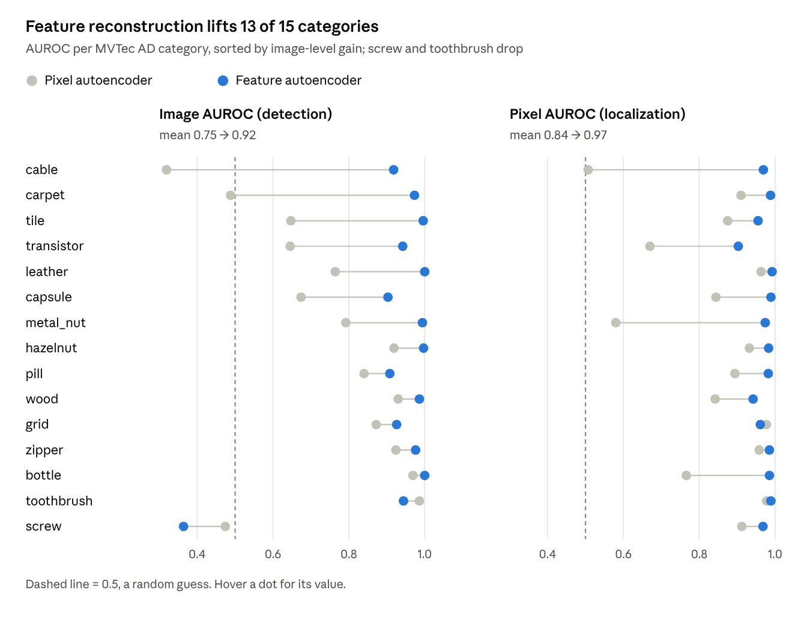
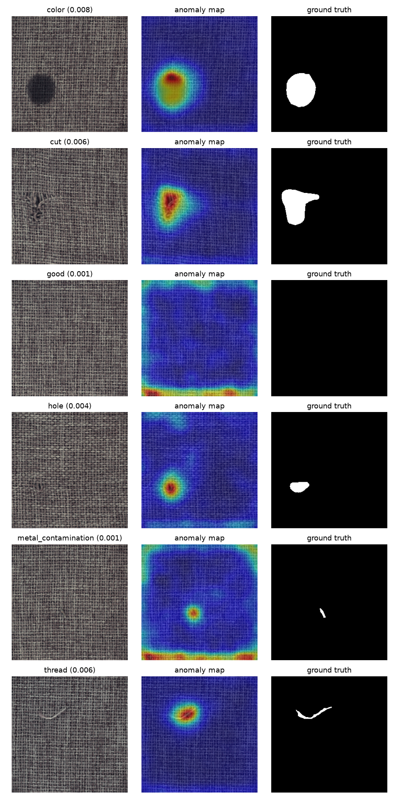
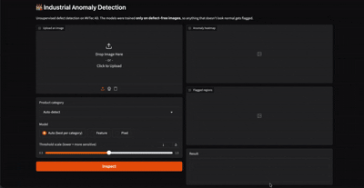

# Industrial Anomaly Detection — Technical Documentation

Aradhya Somani · September 2026

## Overview

The system detects and localizes manufacturing defects without any labeled defects. Its best model, PatchCore with a 1% memory bank, reaches a mean image-level AUROC of 0.982 and a mean pixel-level AUROC of 0.980 across the 15 MVTec AD categories, at about 11 ms per image.

Models are trained only on images of good parts. At inspection time, anything the model cannot reconstruct as "normal" is flagged, and the reconstruction error map shows where the defect is.

- **Problem:** real production lines produce few defects, and new defect types appear without warning. Collecting and pixel-labeling enough defects to train a supervised classifier is slow and expensive, and such a classifier misses defect types it never saw.
- **Approach:** learn what normal looks like, one model per product category, and treat deviation from it as an anomaly. No anomaly labels are used for training or for choosing the decision threshold; test labels and masks are used only to report metrics.
- **Three models, built in order:** a pixel-reconstruction convolutional autoencoder (baseline, mean image AUROC 0.749), a feature-reconstruction autoencoder over a frozen WideResNet-50 (0.923 ± 0.005 over three runs), and PatchCore on the same features (0.982).
- **Deliverable:** a Gradio web app that takes an uploaded image, detects its product category, picks the best model for it, and returns an anomaly heatmap, bounding boxes around suspect regions, and a verdict in about 11 ms on an Apple-silicon GPU.

## System architecture

The system has two stages: an offline training stage that saves one model and threshold per category, and an inspection stage in the app that loads them.



Training runs once per category from the command line. Everything the app needs at inspection time is read from the saved files, so the dataset is not required to run the demo.

| Path | Role |
| --- | --- |
| `src/dataset.py` | MVTec loader, per-category augmentation, test labels and masks |
| `src/model.py` | pixel convolutional autoencoder (`ConvAE`) |
| `src/scoring.py` | device selection, error maps, normalization, smoothing, image score |
| `src/train.py`, `src/evaluate.py` | train and evaluate the pixel model (L2, SSIM and combined scoring) |
| `src/feature_model.py` | WideResNet-50 feature extractor, feature autoencoder, feature anomaly map |
| `src/train_feat.py`, `src/evaluate_feat.py` | train and evaluate the feature model (`--size`, `--topk` options) |
| `src/patchcore.py` | PatchCore: coreset memory bank, evaluation, bank and threshold saved for the app |
| `src/build_category_index.py`, `src/eval_autodetect.py` | build the category-detection index; measure detection accuracy |
| `app.py` | Gradio demo |
| `checkpoints/`, `checkpoints_feat/` | weights, validation indices and calibration files per category |
| `outputs_pixel_baseline/`, `outputs_feat/` | `results.json` and `qualitative.png` per category |
| `examples/` | one good and one defective image for five categories |

## Dataset and augmentation

The project uses MVTec AD: about 5,350 high-resolution images across 15 categories, with only 60–400 defect-free training images per category, so augmentation is chosen per category type.

- **Categories:** 5 textures (carpet, grid, leather, tile, wood) and 10 objects (bottle, cable, capsule, hazelnut, metal_nut, pill, screw, toothbrush, transistor, zipper).
- **Layout:** `train/good/` holds normal images only; `test/` holds good images plus one folder per defect type; `ground_truth/` holds a pixel mask for every defective test image.
- **Preprocessing:** images are resized to 256×256 and scaled to [0, 1]. The feature model additionally normalizes with ImageNet mean and standard deviation.
- **Validation split:** 15% of each category's `train/good` images are held out with a fixed seed (42). They are normal images only, used for early stopping and threshold calibration. Both models use the same split.

The rule for augmentation is that it must never create something that looks like a defect; otherwise the model learns to reconstruct real defects as normal.

| Category type | Categories | Augmentations used | Avoided |
| --- | --- | --- | --- |
| Textures | carpet, grid, leather, tile, wood | horizontal and vertical flips, 90° rotations, brightness/contrast ±5% | noise, blur |
| Rotation-invariant objects | bottle, hazelnut, metal_nut, screw | horizontal and vertical flips, 90° rotations, brightness/contrast ±5% | strong color jitter |
| Orientation-sensitive objects | cable, capsule, pill, toothbrush, transistor, zipper | brightness/contrast ±5% only | flips and rotations (a flipped transistor is itself a defect) |

## Models

Both models are autoencoders trained on normal images only; the feature model wins because it reconstructs pretrained CNN features instead of raw pixels.

| Property | Pixel autoencoder (baseline) | Feature autoencoder (main) |
| --- | --- | --- |
| Code | `src/model.py` (`ConvAE`) | `src/feature_model.py` (`FeatureExtractor`, `FeatureAE`) |
| Input to the autoencoder | RGB image, 3×256×256 | WideResNet-50 features, 1536×32×32 |
| Encoder | 4 stride-2 conv blocks (32→64→128→256 channels, BatchNorm, LeakyReLU 0.2), then a 3×3 conv to the bottleneck | 1×1 conv blocks 1536→868→400, then a 1×1 conv to the latent |
| Bottleneck | 64×16×16 (default `--latent 64`) | 200 channels at 32×32 |
| Decoder | bilinear upsample ×2 + 3×3 conv, four times, sigmoid output | 1×1 conv blocks 200→400→868→1536 |
| Loss | 0.5 · MSE + 0.5 · (1 − SSIM) | MSE on features |
| Optimizer | Adam, lr 1e-3, weight decay 1e-5, cosine schedule | Adam, lr 1e-3 |
| Training | 200 epochs, batch 16 | 60 epochs, batch 8 |
| Checkpoint | `checkpoints/<category>.pt` | `checkpoints_feat/<category>.pt` |

**Pixel autoencoder design choices**

- **SSIM in the loss:** pure MSE gives blurry reconstructions, and the blur along edges shows up as false anomalies. SSIM rewards structure, which is where most defects appear.
- **Upsample plus convolution instead of transposed convolutions:** the first version used `ConvTranspose2d`, which produced a checkerboard pattern in early reconstructions. Those artifacts would register as reconstruction error.
- **Bottleneck size:** too large and the network learns an identity map that reconstructs defects too; too small and it cannot reconstruct normal images. On bottle, latent 128 scored 0.967 SSIM image AUROC against 0.951 for latent 64, a gap within run-to-run variance, so 64 was kept for all categories.

**Feature autoencoder design choices**

- **Frozen backbone:** WideResNet-50-2 with ImageNet weights, kept in eval mode so BatchNorm statistics never change. Layer 2 (512×32×32) and layer 3 (1024×16×16, upsampled to 32×32) are concatenated, then averaged over a 3×3 neighborhood to add local context.
- **1×1 convolutions:** each spatial location is reconstructed independently, so the model learns which feature vectors are normal rather than memorizing image layout.
- **Why it works:** pretrained features already encode texture, color and part identity. Fine texture damage and swapped or missing parts, which are invisible in pixel error, become large feature errors.

**PatchCore** (`src/patchcore.py`, after Roth et al., CVPR 2022)

PatchCore uses the same `FeatureExtractor` (WideResNet-50 layers 2 + 3, 1536 channels at 32×32, 3×3 local averaging) but stores normal patches instead of learning to reconstruct them. Holding the backbone, layers, resolution and validation split fixed isolates one design choice: reconstruction versus lookup.

- **Memory bank:** every 32×32 patch feature from the 85% training split (no augmentation), reduced by greedy coreset selection: iterative farthest-point sampling on a random 128-dimensional projection, keeping 1% of patches (522–3,409 per category, about 3–21 MB).
- **Scoring:** a test patch's score is the Euclidean distance to its nearest neighbour in the bank; the map is upsampled to 256×256 and blurred (σ = 4); the image score is the map's maximum.
- **No training:** building a bank takes 2–46 s per category. The bank and its 95th-percentile threshold are saved to `checkpoints_patchcore/` for the app.
- **Simplifications:** no score reweighting and no channel reduction, both used in the paper, which reports about 0.99 mean image AUROC.

## Anomaly scoring and threshold calibration

Each image gets a 256×256 anomaly map, one score (the mean of its top 1% of map values), and a verdict against a threshold set from normal images only.

**Pixel autoencoder map** (`src/scoring.py`). Two error maps are computed between input x and reconstruction r, each z-normalized with the mean and standard deviation measured on the held-out normal images, then averaged and smoothed with a Gaussian blur (σ = 4):

$$
A(p) = G_{\sigma}\left( \tfrac{1}{2}\,\frac{e_{L2}(p) - \mu_{L2}}{\sigma_{L2}} + \tfrac{1}{2}\,\frac{e_{SSIM}(p) - \mu_{SSIM}}{\sigma_{SSIM}} \right)
$$

Here e_L2 is the squared error averaged over RGB channels, and e_SSIM is 1 minus the local SSIM (window 11). Normalizing with validation statistics rather than each image's own maximum keeps scores comparable across images.

**Feature autoencoder map** (`feature_anomaly_map`). The squared error between the backbone features f and their reconstruction is averaged over the 1536 channels at each of the 32×32 locations, upsampled bilinearly to 256×256, and blurred with σ = 4.

**Image score.** The mean of the highest 1% of map values. A global mean dilutes small defects, and a single maximum is sensitive to one noisy pixel.

**Threshold.** For each category, the image scores of the held-out normal images are collected, and the threshold is their 95th percentile. No defective image is used.

- The first runs used the 99th percentile. With only about 36 validation images, that is effectively the single worst-looking normal image, and it set thresholds too strict: zipper recall was 0.29 even though image AUROC was 0.92.
- Moving to the 95th percentile raised zipper recall to 0.94 without retraining. AUROC measures the model; precision and recall measure the threshold.
- Calibration results are saved per category: `checkpoints/<category>_calib.json` (normalization statistics and a threshold per scoring variant) and `checkpoints_feat/<category>_calib.json` (threshold and latent size). The demo reads these files.

## Evaluation and results

Feature reconstruction raised mean image AUROC from 0.749 to 0.922 and mean pixel AUROC from 0.841 to 0.971, improving 13 of the 15 categories.

**Metrics** (`src/evaluate.py`, `src/evaluate_feat.py`)

- **Image AUROC:** how well image scores separate good from defective test images, independent of any threshold. 0.5 is a random guess, 1.0 is perfect.
- **Pixel AUROC:** how well the anomaly map ranks defective pixels above normal ones, using the ground-truth masks. It measures localization.
- **Precision, recall and F1:** measured at the calibrated 95th-percentile threshold, which shows how the system would behave if deployed.



*Source: `results.json` in `outputs_pixel_baseline/` and `outputs_feat/`, one training run per category.*

The largest gains are on cable, carpet and tile, where the pixel model was near or below random. Screw and toothbrush are the only drops, so the demo keeps the pixel model for those two.

**Run-to-run stability (feature autoencoder, 3 training runs per category).** The headline result is stable: mean image AUROC 0.923 ± 0.005 and mean pixel AUROC 0.971 ± 0.000 across runs. The chart above shows a single run; the table gives mean ± standard deviation.

| Category | Image AUROC | Pixel AUROC |
| --- | --- | --- |
| bottle | 1.000 ± 0.000 | 0.985 ± 0.000 |
| cable | 0.922 ± 0.013 | 0.969 ± 0.002 |
| capsule | 0.906 ± 0.009 | 0.989 ± 0.000 |
| carpet | 0.980 ± 0.006 | 0.988 ± 0.001 |
| grid | 0.860 ± 0.046 | 0.956 ± 0.005 |
| hazelnut | 0.998 ± 0.001 | 0.984 ± 0.000 |
| leather | 0.998 ± 0.001 | 0.992 ± 0.000 |
| metal_nut | 0.995 ± 0.001 | 0.975 ± 0.001 |
| pill | 0.917 ± 0.007 | 0.982 ± 0.001 |
| screw | 0.431 ± 0.076 | 0.967 ± 0.003 |
| tile | 0.997 ± 0.002 | 0.955 ± 0.002 |
| toothbrush | 0.949 ± 0.005 | 0.988 ± 0.000 |
| transistor | 0.931 ± 0.020 | 0.906 ± 0.003 |
| wood | 0.987 ± 0.000 | 0.942 ± 0.003 |
| zipper | 0.975 ± 0.002 | 0.985 ± 0.000 |
| **Mean** | **0.923 ± 0.005** | **0.971 ± 0.000** |

- Grid is the least stable category (± 0.046); its single-run 0.926 in the chart was a favorable run.
- Toothbrush's drop against the pixel model (0.949 ± 0.005 vs 0.986) is consistent across runs, so choosing the pixel model there is justified.
- Screw's spread (± 0.076) is larger than the effect of any change tried on it (see failure analysis).

**Benchmark: PatchCore on the same features.** PatchCore (1% coreset) reaches a mean image AUROC of 0.982 and pixel AUROC of 0.980, the best or tied-best result on 13 of 15 categories. Feature-autoencoder values are three-run means.

| Category | Pixel AE | Feature AE | PatchCore | Feature AE (pix) | PatchCore (pix) |
| --- | --- | --- | --- | --- | --- |
| bottle | 0.969 | 1.000 | 1.000 | 0.985 | 0.986 |
| cable | 0.319 | 0.922 | 0.998 | 0.969 | 0.986 |
| capsule | 0.674 | 0.906 | 0.978 | 0.989 | 0.988 |
| carpet | 0.488 | 0.980 | 0.991 | 0.988 | 0.990 |
| grid | 0.872 | 0.860 | 0.971 | 0.956 | 0.981 |
| hazelnut | 0.919 | 0.998 | 1.000 | 0.984 | 0.988 |
| leather | 0.764 | 0.998 | 1.000 | 0.992 | 0.993 |
| metal_nut | 0.792 | 0.995 | 1.000 | 0.975 | 0.986 |
| pill | 0.840 | 0.917 | 0.954 | 0.982 | 0.978 |
| screw | 0.474 | 0.431 | 0.940 | 0.967 | 0.974 |
| tile | 0.647 | 0.997 | 1.000 | 0.955 | 0.958 |
| toothbrush | 0.986 | 0.949 | 0.928 | 0.988 | 0.988 |
| transistor | 0.645 | 0.931 | 0.998 | 0.906 | 0.971 |
| wood | 0.930 | 0.987 | 0.986 | 0.942 | 0.944 |
| zipper | 0.924 | 0.975 | 0.985 | 0.985 | 0.987 |
| **Mean** | **0.749** | **0.923** | **0.982** | **0.971** | **0.980** |

- **Screw (0.431 → 0.940)** is the clearest result: the same features scored by nearest-neighbour lookup succeed where reconstruction failed. The autoencoder generalizes well enough to reconstruct a slightly damaged thread; a damaged thread has no close match among stored normal patches.
- **Toothbrush** is the exception: with only 51 training images (a 522-patch bank), PatchCore scores 0.928 and the pixel autoencoder 0.986.

**Coreset size.** Keeping 1% of patches instead of 10% changes nothing measurable and makes PatchCore smaller and faster.

| Coreset | Mean image AUROC | Mean pixel AUROC | Bank per category | Build time | Inference |
| --- | --- | --- | --- | --- | --- |
| 10% | 0.980 | 0.981 | 5,222–34,099 patches (~30–210 MB) | 9 s – 6 min | 13–41 ms |
| 1% | 0.982 | 0.980 | 522–3,409 patches (~3–21 MB) | 2–46 s | 11–12 ms |

For comparison, the feature autoencoder's weights are about 14 MB per category and take 10–15 minutes to train.

**Scoring ablation (pixel autoencoder, bottle).** SSIM error separates bottle defects far better than squared pixel error.

| Scoring | Image AUROC | Pixel AUROC | F1 at threshold |
| --- | --- | --- | --- |
| L2 error only | 0.883 | 0.785 | 0.781 |
| SSIM error only | 0.951 | 0.909 | 0.885 |
| L2 + SSIM combined | 0.933 | 0.905 | 0.906 |

Bottle defects (cracks, broken rims, contamination) are structural changes that squared pixel error largely misses. SSIM gives the best ranking; the combined score gave the best F1 at the automatic threshold (99th percentile in this run).

**Failure analysis**

- **Pixel model on textures (carpet 0.488).** It cannot reproduce fine detail such as carpet fibers, so every image has high error and good and bad look alike. Its pixel AUROC stayed at 0.910: the heatmaps found the defects, but scattered error on normal images swamped the image score.
- **Pixel model on cable (0.319, worse than random).** Some cable defects are logical, such as a missing wire or swapped colors. A missing wire makes the image simpler to reconstruct, so it scores as more normal. Pretrained features encode color and part identity, which lifts cable to 0.918.
- **Screw, both models (0.474 pixel, 0.431 ± 0.076 feature).** Localization is good (pixel AUROC 0.967), but image scores for good and defective screws overlap almost completely: every group's mean falls between 0.0034 and 0.0041, and thread defects score lower than good screws on average. The screw's baseline reconstruction error dominates the score, and a defect adds little on top. The likely cause is resolution: each cell of the 32×32 feature map covers a 32×32-pixel patch of the original 1024-pixel photo, so a small scratch or thread defect barely changes its cell's feature vector. Experiments, all within the run-to-run spread:

    | Change | Image AUROC |
    | --- | --- |
    | Baseline (90° rotations, top 1% score, 256 px) | 0.364 |
    | Full-range rotation augmentation | 0.324 |
    | Full rotation + score from top 0.1% of pixels | 0.346 |
    | Full rotation + score from top 0.01% of pixels | 0.350 |
    | 512 px input (64×64 feature map) | 0.424 |

    Doubling resolution helped most but did not lift screw above chance. PatchCore on the same 256-pixel features then reached 0.940, which shows the limit was the reconstruction approach rather than resolution: the feature autoencoder reconstructs slightly damaged threads too well. The demo uses PatchCore for screw.
- **Toothbrush (0.986 pixel, 0.944 feature).** A small drop on a small dataset, likely within run-to-run variance.



## Demo application

`app.py` is a Gradio app that identifies the product category automatically and inspects an uploaded image in about 11 ms with PatchCore (about 30 ms with the autoencoders) on an Apple-silicon GPU.



**Inputs**

- **Image:** any upload, or one of the one-click examples in `examples/` (a good and a defective image for bottle, carpet, hazelnut, screw and zipper).
- **Product category:** `Auto-detect` (default) or one of the trained categories, listed from the files in `checkpoints_feat/`.
- **Model:** `Auto (best per category)`, `PatchCore`, `Feature AE` or `Pixel AE`. Auto compares each category's image AUROC in `outputs_patchcore/`, `outputs_feat/` and `outputs_pixel_baseline/` and uses the best, which is PatchCore for 13 categories, the pixel autoencoder for toothbrush and the feature autoencoder for wood.
- **Threshold scale:** a slider from 0.5 to 1.5 that multiplies the calibrated threshold, to show the precision/recall trade-off live.

**Outputs**

- **Anomaly heatmap:** the map colored with the JET colormap relative to twice the threshold, not the image's own maximum, so normal images stay mostly blue.
- **Flagged regions:** bounding boxes drawn only when the image is anomalous, around connected regions above the larger of the threshold and half the map's maximum; regions under 30 pixels are dropped.
- **Result:** verdict, detected category, score, threshold, model used, and inference time.

**Automatic category detection.** Inspecting an image with the wrong category's model makes the whole frame look anomalous (a hazelnut checked by the bottle model lights up everywhere), so the app identifies the product first. It reduces the WideResNet feature map to one global vector (the average over all positions, L2-normalized) and assigns the category held by most of the 5 nearest training images (`src/build_category_index.py`, index of 3,629 normal training images). It routes all 1,725 MVTec test images correctly.

The first version used a different rule: assign the category whose autoencoder finds the image most normal (lowest score ÷ threshold). Measured with `src/eval_autodetect.py`, it was right for 99.6% of good images but only 68.8% of defective ones, because a defect is designed to make an image look abnormal to its own model. Misrouted images went mostly to screw and hazelnut, whose models score every image in a narrow band. In the demo this was a silent failure: a damaged carpet could be routed to the screw model and reported as normal. A global feature vector describes what the product is, and a small local defect barely moves it.

| Method | Good images | Defective images | Overall (1,725) |
| --- | --- | --- | --- |
| Lowest score ÷ threshold | 99.6% | 68.8% | 77.2% |
| 5 nearest training images, global features | 100% | 100% | 100% |

**Performance.** The backbone is loaded once at startup and runs once per image; its output serves both category detection (one matrix product against the index) and scoring. Each category's autoencoder is cached on first use.

**Hosting.** The demo runs locally with `python app.py`. For a temporary public link, change the last line to `demo.launch(share=True)`; the link works while the app is running.

## Setup and usage

Everything runs locally with Python 3.12 or later, and uses CUDA or Apple-silicon (MPS) automatically, falling back to CPU.

1. Create and activate the environment, then install dependencies:

   ```bash
   python3 -m venv venv
   source venv/bin/activate
   pip install -r requirements.txt
   ```
2. Download MVTec AD from Kaggle (`ipythonx/mvtec-ad`) and unzip it so that the category folders sit directly inside `data/`.
3. Train and evaluate one category with each model:

   ```bash
   python src/train.py --category bottle --epochs 200
   python src/evaluate.py --category bottle --pct 95
   python src/train_feat.py --category bottle
   python src/evaluate_feat.py --category bottle
   ```
4. Train all 15 categories, which takes about 4–6 hours for the pixel model and 2–4 hours for the feature model on a MacBook GPU:

   ```bash
   for c in bottle cable capsule carpet grid hazelnut leather metal_nut pill screw tile toothbrush transistor wood zipper; do
     python -u src/train_feat.py --category $c && python -u src/evaluate_feat.py --category $c
   done 2>&1 | tee outputs_feat_all.log
   ```
5. Run the demo and open `http://127.0.0.1:7860`:

   ```bash
   python app.py
   ```

**Script options**

| Script | Option | Default | Meaning |
| --- | --- | --- | --- |
| `train.py` | `--category`, `--epochs`, `--bs`, `--lr`, `--latent`, `--size` | bottle, 200, 16, 1e-3, 64, 256 | category, training length, batch size, learning rate, bottleneck channels, image size |
| `evaluate.py` | `--latent`, `--pct` | 64, 99 | must match training; threshold percentile (use 95) |
| `train_feat.py` | `--epochs`, `--bs`, `--lr`, `--latent` | 60, 8, 1e-3, 200 | training length, batch size, learning rate, latent channels |
| `evaluate_feat.py` | `--latent`, `--pct` | 200, 95 | must match training; threshold percentile |

**Outputs.** Evaluation writes `results.json` (AUROC, precision, recall, F1) and `qualitative.png` (input, reconstruction where relevant, anomaly map and ground truth for one image per defect type) under `outputs/`, `outputs_feat/` and the frozen baseline copy `outputs_pixel_baseline/`.

**Known setup issues**

- `python` or `pip` not found on macOS: use `python3`, or activate the venv first.
- `CERTIFICATE_VERIFY_FAILED` when downloading WideResNet weights: run `Install Certificates.command` from the python.org install, or download the weights with `curl` into `~/.cache/torch/hub/checkpoints/`.
- No output from a loop piped through `tee`: run Python with `-u` to disable output buffering.
- Long runs: keep the Mac on power with `caffeinate -i` running in a second terminal.

## Limitations and future work

With PatchCore, every category except toothbrush and screw scores 0.95 or higher; the remaining gaps are small-data categories and the noisy thresholds that come from small validation sets.

**Limitations**

- **One model per category.** Fifteen checkpoints must be stored and loaded; a single multi-class model would be simpler to deploy.
- **Small calibration sets.** Thresholds come from about 10–60 normal images per category, so they shift between runs. A production system would calibrate on more data and set the operating point from the cost of a missed defect versus a false alarm.
- **Run-to-run variance.** The feature model was trained three times per category (mean ± std above); the pixel model was trained once, and its bottle pixel AUROC moved from about 0.91 to 0.766 between two identical runs, so small pixel-model differences may be noise.
- **Logical defects.** Reconstruction error cannot directly detect "parts in the wrong arrangement"; feature reconstruction helps (cable 0.918) but does not guarantee it.
- **Controlled imaging assumed.** MVTec images have fixed lighting, background and framing. Photos taken under other conditions would fall outside what the models learned as normal.

**Future work**

- [x] Full-range rotation augmentation and finer top-k scoring for screw (no gain beyond run-to-run spread)
- [x] 512 px input for screw (0.364 → 0.424, still below chance)
- [x] Report mean ± standard deviation over three runs per category
- [x] Measure automatic category detection, and replace the score-based rule with nearest neighbors on global features (68.8% → 100% on defective images)
- [x] Benchmark against PatchCore (implemented on the same features; 0.982 mean image AUROC, screw 0.431 → 0.940)
- [x] Coreset ablation (1% matches 10% at a tenth of the size)
- [ ] Add PatchCore's score reweighting to close the gap to the published ~0.99
- [ ] Add the PRO score, the official MVTec localization metric
- [ ] Break results down by defect type
- [ ] Export to ONNX and report CPU latency
